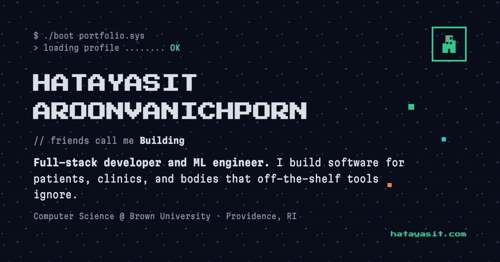

# Hatayasit Aroonvanichporn · Portfolio

My personal site, rebuilt from scratch in React and TypeScript for the Full Stack at Brown developer application. Live at [hatayasit.com](https://www.hatayasit.com).



## Overview

A single-page portfolio with a retro terminal theme. Four things on it are interactive:

- **Project gallery with category filters.** Buttons for Web, Mobile, ML & vision and Education filter the list of projects. The active filter is React state; the visible list is derived from it and each project is passed to a card component through props.
- **An in-page terminal.** Press the backtick key or click the terminal button, then type `help`, `projects`, `open haemocare`, `goto contact`, `theme`, and so on. It has command history (up and down arrows) and reads the same data files as the rest of the page, so it never goes out of sync with the gallery.
- **An "I'm boring" switch.** One button in the nav (or the `boring` command in the terminal) strips the game layer: the pixel fonts become Martian Grotesk (the sans sibling of the Martian Mono the retro mode is set in, so both modes are one type family), the scanlines, starfield, fake window bars and 3D scene disappear, and panels go flat and rounded. It is one piece of React state mirrored onto `<html data-mode>`; the restyling is pure CSS keyed off that attribute, the scene simply isn't mounted (so three.js never downloads), and the choice persists in `localStorage`. Boring mode is deliberately flat and quiet, with no gradients or glows: one typeface whose hierarchy comes from its weight and width axes, size-specific tracking, a translucent nav whose hairline only appears once you scroll, controls that respond on press, and project filters that become a segmented control. The switch itself cross-fades through the View Transitions API (`src/lib/viewTransition.ts`), and the same mechanism slides the segmented control's thumb, with reduced-motion, reduced-transparency and high-contrast fallbacks. The font is self-hosted in `public/fonts/`, and because a browser only fetches a font once some text uses it, retro mode never downloads it.
- **A card deck you can throw** (boring mode only, where the avatar would be). Six quick facts as a stack of cards. Drag the top one and it stays glued to the pointer; flick it and it flies off and tucks itself under the stack; let go gently and it springs home; catch it in mid-air and it stops in your hand. There is no animation library: the motion is a damped spring I wrote in `src/lib/spring.ts`, which inherits the pointer's release velocity and decides whether a gesture was a throw from where it was *going*, not where it was let go. It also works with a tap, the arrow keys, Previous and Next buttons, and announces each card to screen readers.

On wide screens the hero also shows a **voxel avatar** of me (Brown hoodie with the university arms, AirPods, four-point crutch, sabre) rendered with three.js. It is described as boxes on a grid in `src/data/avatar.ts` and drawn as instanced meshes. Behind it stands Silver Chariot, my Stand, holding a rapier in the same pose. When the page loads the avatar wakes up: eyes open with a sleepy blink, head lifts, the sabre swings up into guard, the music starts (a head nod at 124 BPM with pixel notes drifting up), and then the Stand is summoned out from behind. After that it idles, blinks, and follows the mouse. three.js and the models are loaded on demand, on wide screens only, so they never touch the initial bundle, and reduced-motion users get a single still frame.

Also: dark and light themes persisted in `localStorage`, scroll-triggered reveals, a nav that marks the section you are currently reading, a mobile menu, and full support for `prefers-reduced-motion` and keyboard focus.

## How to run it

Requires Node 20 or newer.

```bash
npm install
npm run dev        # http://localhost:5173
```

Other scripts:

```bash
npm run build      # typecheck + production build into dist/
npm run preview    # serve the production build locally
npm run lint       # oxlint
npm run typecheck  # tsc
npm test           # vitest: unit tests for the spring maths
```

## How it is put together

```
src/
  data/           all content: profile.ts, projects.ts, experience.ts, deck.ts, avatar.ts (voxel model)
  components/     one file per UI piece; Projects -> ProjectCard is the props flow
                  HeroScene.tsx owns the three.js canvas (fun mode)
                  CardDeck.tsx owns the card deck (boring mode)
  hooks/          useTheme (dark/light), useBoring (game layer on/off), useReveal (IntersectionObserver)
                  useActiveSection (which section the nav should mark as current)
  lib/terminal.ts pure function: command string in, output lines + optional action out
  lib/spring.ts   pure maths: a damped spring, momentum projection, rubber-banding (+ spring.test.ts)
  lib/poseStand.ts poses the Stand's static mesh: two virtual bones per arm, blended rotations
  lib/viewTransition.ts wraps a state update in a View Transition (cross-fades, sliding thumb)
  index.css       theme tokens, retro primitives (pixel-frame, btn, chip), motion
```

Updating the site means editing a file in `src/data/`. Components never hard-code text.

Dependencies are deliberately few: `react`, `react-dom`, `lucide-react` for icons, `tailwindcss` for layout utilities, and `three` for the avatar (split into its own chunk and imported lazily). The card deck uses no animation or gesture library. `vitest` is the only test dependency. The retro look (offset shadows, checkerboard covers, scanlines, the boot animation) is hand-written CSS in `src/index.css`.

## My contribution

Everything in this repository is mine. The previous version of this site was generated with a website builder; this one was written by hand file by file so I could explain every line of it. The pieces I would point to first:

- `src/lib/terminal.ts` and `src/components/Terminal.tsx`: the command parser and the component that owns its state.
- `src/components/Projects.tsx`: the filter state and how the visible list is derived from it.
- `src/lib/spring.ts` and `src/components/CardDeck.tsx`: the same split as the terminal. The spring, the momentum projection and the rubber-band are pure functions with unit tests. The component holds an engine that runs one `requestAnimationFrame` loop and writes `transform` straight to the cards, so dragging never re-renders React. The only React state is the card order.
- `src/components/HeroScene.tsx` and `src/data/avatar.ts`: the voxel avatar, and the wake-up sequence written as one `pose(t)` function where every step has its own 0 to 1 progress.
- `src/lib/poseStand.ts`: the Silver Chariot model has no skeleton, so I pose its arms procedurally by rotating the vertices along each arm about a shoulder and an elbow pivot, with the rotation blended in around each joint.
- `src/components/Nav.tsx` and `public/favicon.svg`: the site's mark, a small building, because Building is what people call me. The silhouette and its windows are one path with an even-odd fill rule, so the windows are real holes and the mark stays correct on any surface. One window is lit.
- `src/hooks/useActiveSection.ts`: the nav marks the section you are reading. The rule is the one you would say out loud, which is the last section whose top has passed a line just under the nav, with the end of the page always belonging to the last section. I chose it over `IntersectionObserver` on purpose, because that answers "is any part of this on screen", which is a different question and leaves gaps when two sections share the viewport.
- `src/hooks/useTheme.ts` plus the small inline script in `index.html` that applies the saved theme before the first paint.
- `src/index.css`: the theme token system and the retro primitives.

## What I learned

<!-- TODO(Hatayasit): edit this so it is in your own words. It should describe one real challenge. -->

The hardest part was keeping the terminal explainable. My first version put everything in the component: a large `switch` on the command string, and side effects like `window.open` and toggling the theme mixed in with `setState` calls. It worked, but I could not describe it in one breath, and every new command made it worse.

The fix was to split it in two. `runCommand()` in `src/lib/terminal.ts` is a pure function: it takes the input string and returns `{ lines, action? }`, where `action` is a plain object such as `{ type: 'open', url }`. It never touches React or the DOM. `Terminal.tsx` then only does three things: keep the input and printed lines in state, call `runCommand`, and perform whatever action came back. That made the parser trivial to test by hand in the console and made the component about fifty lines.

A smaller lesson was typography. Pixel fonts have square glyphs, so my fifteen-letter surname needs roughly fifteen `em` of width. On a 390px phone that overflowed the screen. The fix was `font-size: clamp(1.15rem, 5.2vw, 3rem)` tied to the viewport width, and a deliberate line break between first and last name.

## References

- [Vite](https://vite.dev) `react-ts` template for the initial project scaffold (`package.json`, `tsconfig`, `oxlint` config).
- [React docs](https://react.dev) for `useState`, `useEffect` and `useRef`.
- [Tailwind CSS v4 docs](https://tailwindcss.com/docs) for the `@theme inline` pattern that lets utilities reference runtime CSS variables.
- [three.js](https://threejs.org) docs for `InstancedMesh`, `OrthographicCamera`, and lights, used for the voxel avatar.
- [lucide-react](https://lucide.dev) for UI icons; GitHub and LinkedIn marks are from [Simple Icons](https://simpleicons.org) (CC0).
- [Google Fonts](https://fonts.google.com): Press Start 2P for headings and Martian Mono (a variable font, run at a lighter weight and narrower width) for body text.
- [Martian Grotesk](https://github.com/evilmartians/grotesk) by Evil Martians, the typeface of boring mode, self-hosted under the SIL Open Font License (the licence is in `public/fonts/`).
- The Silver Chariot model behind the avatar is [Silver Chariot](https://sketchfab.com/3d-models/silver-chariot-86a6bf8c3ece40818f7042dbbe5720c6) by [xugangruix](https://sketchfab.com/xugangruix) on Sketchfab, licensed [CC BY 4.0](https://creativecommons.org/licenses/by/4.0/). I resized its textures to WebP and render it translucent; the character is from *JoJo's Bizarre Adventure* by Hirohiko Araki.
- The Brown University coat of arms on the avatar's hoodie is rasterised from [Brown Coat of Arms.svg](https://commons.wikimedia.org/wiki/File:Brown_Coat_of_Arms.svg) on Wikimedia Commons (CC BY-SA 4.0). The arms themselves belong to Brown University.
- Apple's WWDC 2018 talk [Designing Fluid Interfaces](https://developer.apple.com/videos/play/wwdc2018/803/) for the ideas behind the card deck: springs described by response and damping ratio, handing the finger's velocity to the animation, the momentum projection formula, and rubber-banding. The code is my own.
- MDN for `IntersectionObserver`, `prefers-reduced-motion`, [Pointer events](https://developer.mozilla.org/en-US/docs/Web/API/Pointer_events) and the [View Transition API](https://developer.mozilla.org/en-US/docs/Web/API/View_Transition_API).
- [Vitest](https://vitest.dev) for the unit tests.
- Claude Code was used as a pair programmer while rebuilding the site. All code was read, understood, and edited by me. <!-- TODO(Hatayasit): keep, reword, or remove this line. -->
