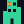
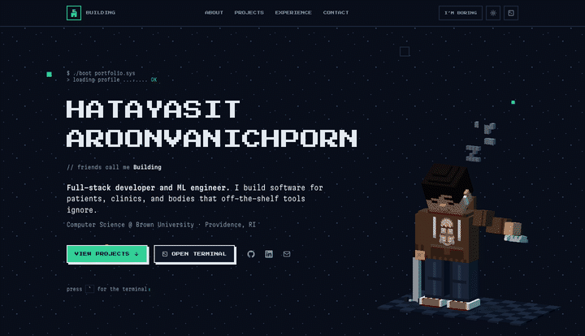
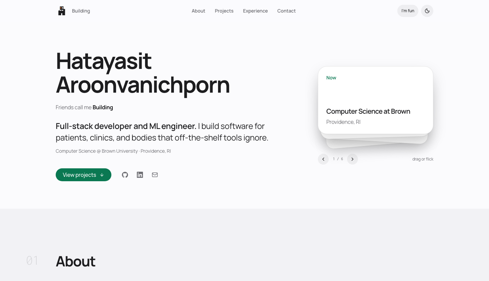

#  Hatayasit Aroonvanichporn · Portfolio

My personal site, built from scratch in React and TypeScript.

<h6 align="center">
  <a href="https://www.hatayasit.com">Live site</a>
  ·
  <a href="#-overview">What it does</a>
  ·
  <a href="#-how-to-run-it">Run it</a>
  ·
  <a href="#-my-contribution">What I built</a>
</h6>

<table>
<tr>
<td width="50%"></td>
<td width="50%"></td>
</tr>
<tr>
<td><b>Default.</b> Pixel type, a voxel self-portrait, a terminal on <kbd>`</kbd>.</td>
<td><b>After “I’m boring”.</b> Same components with the game layer switched off.</td>
</tr>
</table>

**React 19 · TypeScript · Vite 8 · Tailwind v4 · three.js** — at runtime, only React, three.js and Lucide's icons ship.

##  Overview

- **Project gallery with category filters.** Pick a category and the list narrows to match; each project reaches `ProjectCard` through props.
- **An in-page terminal.** Press <kbd>`</kbd> to open it. It has eleven commands and arrow-key history, and it reads the same data files as the page.
- **An "I'm boring" switch.** It sets one attribute on `<html>`, and every visual difference above is CSS keyed off that attribute. Boring mode never mounts the 3D scene, so it never downloads three.js either.
- **A card deck you can throw.** Drag a card, flick it, or catch it mid-flight. On release I project where its speed would carry it, and the card only goes to the back if that point lands far enough out; otherwise a damped spring pulls it home.

<details>
<summary>What the terminal knows</summary>

```console
❯ help
help             show this list
about            who I am
projects         list projects (alias: ls)
open <slug>      open a project repo in a new tab
skills           grouped skill list
experience       work and awards
contact          email, GitHub, LinkedIn
goto <section>   scroll to about | projects | experience | contact
theme            toggle dark / light
boring           turn off the retro game styling
clear            clear the screen
```

</details>

##  How to run it

Node 22.12 or newer. Vite runs on 20.19+, but the test runner needs 22.12.

```bash
npm install
npm run dev      # http://localhost:5173
npm test         # 8 unit tests over the spring maths
npm run lint     # oxlint
npm run typecheck
```

##  How it is put together

```
src/
  data/        profile, projects, experience, deck, avatar (the voxel model)
  components/  one file per UI piece
  hooks/       useTheme, useBoring, useReveal, useActiveSection
  lib/         terminal, spring (+ spring.test.ts), poseStand, viewTransition
  index.css    theme tokens, retro primitives, motion
```

The content lives in `src/data/`: the projects, the experience, the bio, even what the terminal prints. Components keep only the small labels around it. Three of the four files in `lib/` never import React, which is why they are easy to test.

##  My contribution

I led the architecture and design and used an agentic CLI tool to move faster on implementation. Every change went through my review, and I can explain how each file works. These four are where I'd start.

- **`components/Projects.tsx`** — the main interaction, in 64 lines around a single `useState`. In boring mode the filter change runs inside a View Transition, so the selected button slides across. This is the file I would most like to be asked about.
- **`lib/spring.ts` + `components/CardDeck.tsx`** — one `requestAnimationFrame` loop writes `transform` straight to the cards, so dragging never re-renders React. The component re-renders only when the card order changes or the hint goes away.
- **`lib/poseStand.ts`** — the Silver Chariot model (the Stand) has no skeleton, so I pose its arms by rotating vertices about virtual shoulder and elbow joints.
- **`components/Nav.tsx` + `public/favicon.svg`** — my nickname is Building, so the logo is one. It is a single path with an even-odd fill, which makes the windows real holes.

##  What I learned

Keeping the terminal explainable was the hard part. My first version put everything in the component: a long `switch` on the command string, with `window.open` and theme toggles tangled into the `setState` calls. It worked, but I couldn't explain it without scrolling up and down the file.

So I split it in two. `runCommand()` in `src/lib/terminal.ts` takes the input and returns `{ lines, action? }`, where `action` is a plain object such as `{ type: 'open', url }`, and it never touches React or the DOM. The component holds the state, calls `runCommand()`, and carries out whatever action comes back. Adding a command now means adding one `case` to `terminal.ts`.

##  References

- Scaffolded from the [Vite](https://vite.dev) `react-ts` template.
- The deck's spring maths comes from Apple's [Designing Fluid Interfaces](https://developer.apple.com/videos/play/wwdc2018/803/), WWDC 2018.
- The Stand behind the avatar is [Silver Chariot](https://sketchfab.com/3d-models/silver-chariot-86a6bf8c3ece40818f7042dbbe5720c6) by [xugangruix](https://sketchfab.com/xugangruix), [CC BY 4.0](https://creativecommons.org/licenses/by/4.0/); the character is from *JoJo's Bizarre Adventure*.
- The [Brown coat of arms](https://commons.wikimedia.org/wiki/File:Brown_Coat_of_Arms.svg) on the hoodie, CC BY-SA 4.0.
- Type: Press Start 2P, Martian Mono, Manrope, Inconsolata — all OFL, licences in `public/fonts/`. Heading icons from [Lucide](https://lucide.dev) (ISC).
