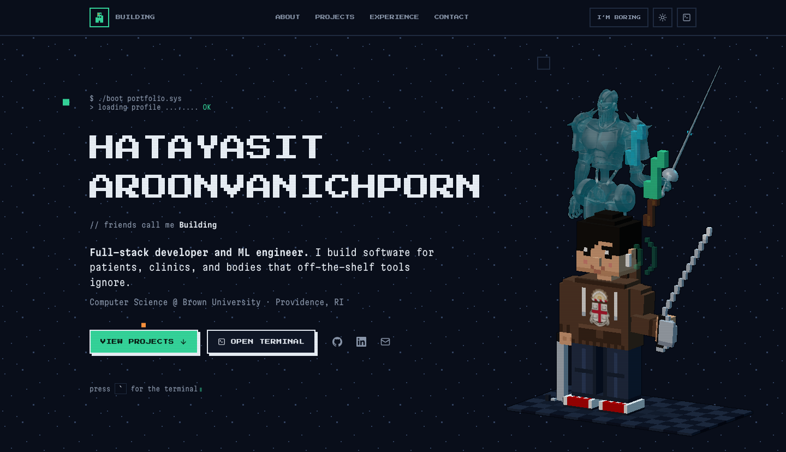

#  Hatayasit Aroonvanichporn · Portfolio

My personal site, rebuilt from scratch in React and TypeScript for the Full Stack at Brown developer application. Live at [hatayasit.com](https://www.hatayasit.com).

<table>
<tr>
<td width="50%"></td>
<td width="50%"></td>
</tr>
<tr>
<td><b>Default.</b> Pixel type, scanlines, a voxel self-portrait, a terminal on <kbd>`</kbd>.</td>
<td><b>After pressing “I’m boring”.</b> Same content, same components, no game layer.</td>
</tr>
</table>

One button swaps those. It is a single piece of React state mirrored onto `<html data-mode>`: every difference above is CSS keyed off that attribute, and the 3D scene is never mounted, so boring mode never downloads three.js.

## Overview

Four things are interactive.

**Project gallery with category filters** (Web, Mobile, ML & vision, Education). The active filter is the only state; the visible list is derived from it on every render, and each project reaches `ProjectCard` through props. HaemoCare and Equipose lead as full-width cards, HaemoCare beside a screenshot of the running app. Projects with no public code say why — internal to MFEC, a printed textbook — instead of quietly dropping the buttons.

**An in-page terminal.** <kbd>`</kbd> or the terminal button opens it; the arrow keys walk back through history. It reads the same data files as the page, so it cannot disagree with the gallery.

**The "I'm boring" switch.** It takes away the scanlines, the starfield, the fake window bars and the panels, leaving content separated by hairlines, and lays the page out on one rule: facts left in a monospace, prose right, every section aligned to the same rail. The choice persists in `localStorage`. The switch cross-fades through the View Transitions API (`src/lib/viewTransition.ts`), which also slides the filter thumb; reduced motion, reduced transparency and high contrast each have a fallback.

**A card deck you can throw** (boring mode only, where the avatar would be). Six facts as a stack. Drag the top card and it tracks the pointer; flick it and it flies off and tucks under the stack; release gently and it springs home; catch it mid-flight and it stops in your hand. There is no animation library — `src/lib/spring.ts` is a damped spring that inherits the pointer's release velocity and judges a throw by where the card was *going*, not where it was let go. Tap, arrow keys and the Previous and Next buttons do the same work, and each card is announced to screen readers.

On wide screens the hero carries a **voxel avatar**: Brown hoodie with the university arms, AirPods, four-point crutch, sabre, described as boxes on a grid in `src/data/avatar.ts` and drawn as instanced meshes. Silver Chariot stands behind it holding a rapier in the same pose. On load the avatar wakes — eyes open, head lifts, sabre swings into guard, a head nod at 124 BPM with pixel notes drifting up — and then the Stand is summoned. After that it idles, blinks, and follows the mouse. Reduced motion gets one still frame.

Also: dark and light themes in `localStorage`, scroll-triggered reveals, a nav that tracks the section you are reading, a mobile menu, and keyboard focus throughout.

## How to run it

Requires Node 22.12 or newer. Vite runs on 20.19+, but the test runner needs 22.12.

```bash
npm install
npm run dev        # http://localhost:5173
```

```bash
npm run build      # typecheck + production build into dist/
npm run preview    # serve the production build locally
npm run lint       # oxlint
npm run typecheck  # tsc
npm test           # vitest: 8 unit tests over the spring maths
```

## How it is put together

```
src/
  data/        profile, projects, experience, deck, avatar (the voxel model)
  components/  one file per UI piece; HeroScene owns the three.js canvas, CardDeck the deck
  hooks/       useTheme, useBoring, useReveal, useActiveSection
  lib/         terminal, spring (+ spring.test.ts), poseStand, viewTransition
  index.css    theme tokens, retro primitives, motion
```

Every string on the page comes from `src/data/`; no component hard-codes text. Three of the four files in `lib/` import no React at all — the command parser, the spring maths and the Stand's pose — which is what makes them straightforward to test and to explain.

Four runtime dependencies: `react`, `react-dom`, `lucide-react` for icons, and `three`, which sits in its own chunk behind the dynamic import in `HeroScene.tsx`. Tailwind is build-time only and supplies layout utilities; the retro look — offset shadows, checkerboard covers, scanlines, the boot animation — is hand-written CSS. The card deck uses no animation or gesture library, and `vitest` is the only test dependency.

One third party reaches the browser: the listening card embeds a Spotify player in an `iframe`. It is lazy-loaded and exists only in boring mode, so fun mode never contacts Spotify.

## My contribution

Everything here is mine. The previous version of this site came out of a website builder; this one was written by hand, file by file, so I can explain any line of it. Where I would start:

- `src/components/Projects.tsx` — 64 lines, one `useState`, no reducer and no memoisation. The main interaction, and the part I would most like to be asked about.
- `src/lib/terminal.ts` and `src/components/Terminal.tsx` — the parser and the component that owns its state. Why they are separate is under *What I learned*.
- `src/lib/spring.ts` and `src/components/CardDeck.tsx` — the same split. Spring, momentum projection and rubber-band are pure functions with unit tests; the component runs one `requestAnimationFrame` loop and writes `transform` straight to the cards, so dragging never re-renders React. Its only state is the card order.
- `src/lib/poseStand.ts` — the Silver Chariot model has no skeleton, so I pose its arms by rotating the vertices along each arm about a shoulder and an elbow pivot, blending the rotation in around each joint.
- `src/components/HeroScene.tsx` and `src/data/avatar.ts` — the avatar, and its wake-up written as one `pose(t)` where every step owns its own 0-to-1 progress.
- `src/hooks/useActiveSection.ts` — the rule is the one you would say out loud: the last section whose top has passed a line just under the nav, with the end of the page always belonging to the last section. I chose it over `IntersectionObserver`, which answers "is any part of this on screen" — a different question that leaves gaps when two sections share the viewport.
- `src/components/Nav.tsx` and `public/favicon.svg` — the mark, a building, because Building is what people call me. Silhouette and windows are one path with an even-odd fill rule, so the windows are real holes and the mark survives any background. One window is lit.
- `src/hooks/useTheme.ts` and the inline script in `index.html` that applies the saved theme before the first paint, so the page never flashes the wrong colours.
- `src/index.css` — the theme token system and the retro primitives.

## What I learned

The hardest part was keeping the terminal explainable. My first version kept everything in the component: a long `switch` on the command string, with `window.open` and theme toggles tangled into the `setState` calls. It worked, but I could not describe it in one breath, and every new command made that worse.

Splitting it in two fixed it. `runCommand()` in `src/lib/terminal.ts` takes the input string and returns `{ lines, action? }`, where `action` is a plain object like `{ type: 'open', url }`. It never touches React or the DOM. `Terminal.tsx` keeps the input, the printed lines and the history in state, calls `runCommand`, and carries out whatever action comes back. Adding a command is now one `case` in a file that has never imported React, and the component is down to two short functions and its markup.

A smaller lesson was typography. Pixel glyphs are square, so my fifteen-letter surname wants roughly fifteen `em` of width, which overflowed a 390px phone. The fix was `clamp(1.15rem, 5.2vw, 3rem)` tied to the viewport, and a deliberate break between first and last name.

## References

- [Vite](https://vite.dev) `react-ts` template for the initial scaffold (`package.json`, `tsconfig`, `oxlint` config).
- [React docs](https://react.dev) for `useState`, `useEffect` and `useRef`.
- [Tailwind CSS v4 docs](https://tailwindcss.com/docs) for the `@theme inline` pattern that lets utilities reference runtime CSS variables.
- [three.js](https://threejs.org) docs for `InstancedMesh`, `OrthographicCamera` and lights.
- [lucide-react](https://lucide.dev) for UI icons; the GitHub and LinkedIn marks are from [Simple Icons](https://simpleicons.org) (CC0).
- Type: [Press Start 2P](https://fonts.google.com/specimen/Press+Start+2P) and [Martian Mono](https://fonts.google.com/specimen/Martian+Mono) from Google Fonts in retro mode. Boring mode is [Manrope](https://github.com/googlefonts/manrope) by Mikhail Sharanda, with [Inconsolata](https://github.com/googlefonts/Inconsolata) by Raph Levien on the metadata rail; both self-hosted as Latin-subset variable fonts under the SIL Open Font License, licences in `public/fonts/`.
- The Stand behind the avatar is [Silver Chariot](https://sketchfab.com/3d-models/silver-chariot-86a6bf8c3ece40818f7042dbbe5720c6) by [xugangruix](https://sketchfab.com/xugangruix) on Sketchfab, [CC BY 4.0](https://creativecommons.org/licenses/by/4.0/). I resized its textures to WebP and render it translucent; the character is from *JoJo's Bizarre Adventure* by Hirohiko Araki.
- The Brown University coat of arms on the hoodie is rasterised from [Brown Coat of Arms.svg](https://commons.wikimedia.org/wiki/File:Brown_Coat_of_Arms.svg) on Wikimedia Commons (CC BY-SA 4.0). The arms belong to Brown University.
- Apple's WWDC 2018 talk [Designing Fluid Interfaces](https://developer.apple.com/videos/play/wwdc2018/803/) for the ideas behind the deck: springs described by response and damping ratio, handing the finger's velocity to the animation, the momentum projection formula, rubber-banding. The code is my own.
- MDN for `IntersectionObserver`, `prefers-reduced-motion`, [Pointer events](https://developer.mozilla.org/en-US/docs/Web/API/Pointer_events) and the [View Transition API](https://developer.mozilla.org/en-US/docs/Web/API/View_Transition_API).
- The listening card embeds a [Spotify](https://open.spotify.com) player through their standard embed URL.
- [Vitest](https://vitest.dev) for the unit tests.
